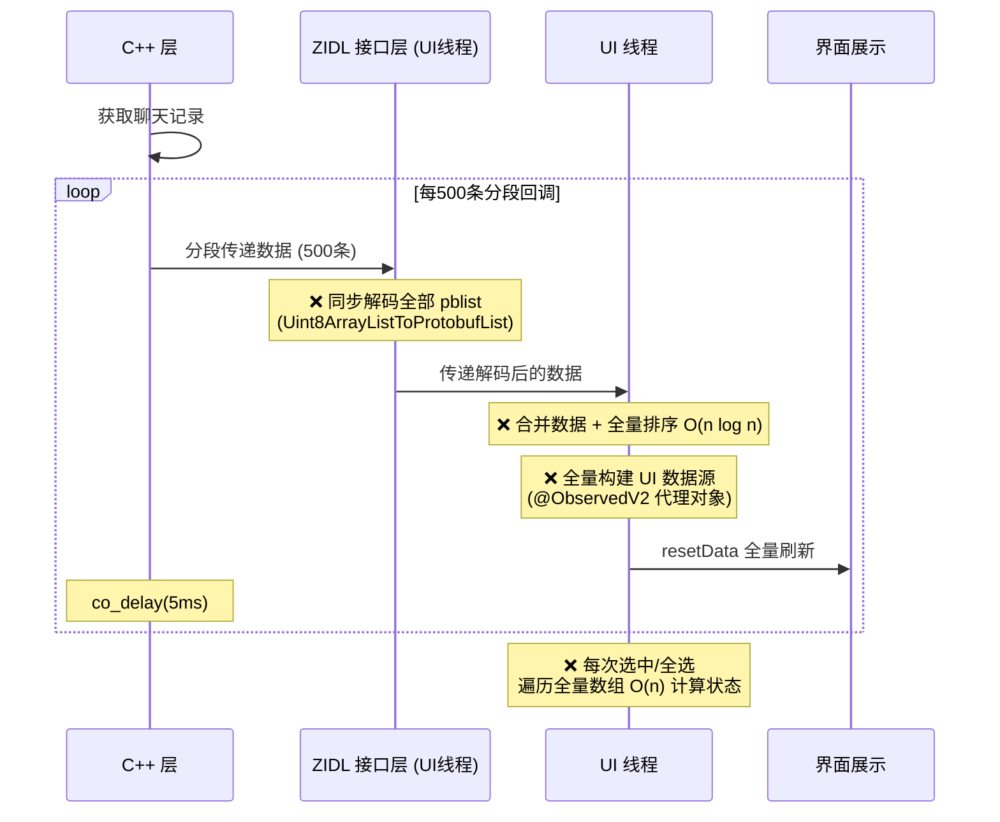
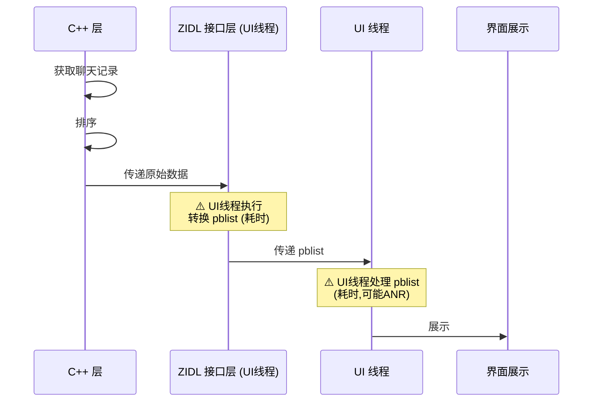
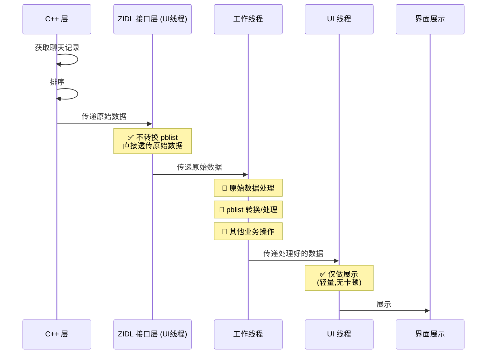
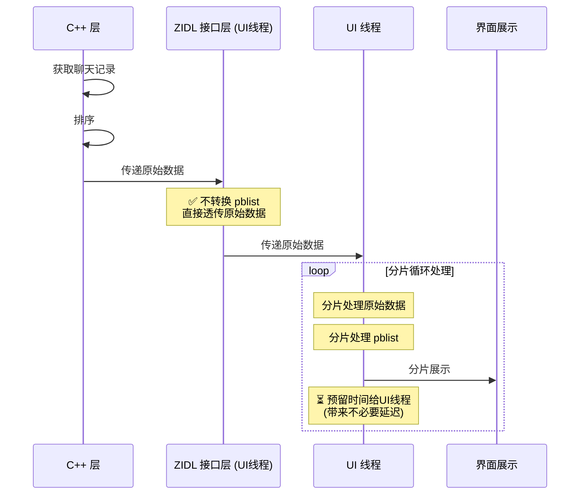

# 技术产出：鸿蒙微信聊天文件管理页面 ANR 问题优化

## 一、问题背景

微信聊天记录存储管理页面（`ChatRecordMediaPicker`）在加载用户可清理的媒体文件列表时，由于微信用户持有的媒体文件数量远超业界其他应用（可达数万甚至十万级别），导致 UI 线程长时间阻塞，触发 ANR（Application Not Responding）。

**核心矛盾**：大量媒体文件的 Protobuf 解码 + UI 数据源构建 + LazyForEach 渲染，全部在单帧内同步完成，超出系统 5s 响应阈值。

**最严重的时候是现网TOP8的P0级问题，大量用户反馈投诉**

## 二、问题分析

通过性能打点定位，ANR 的耗时主要集中在以下环节：

| 阶段 | 原实现方式 | 耗时瓶颈 |
|------|-----------|----------|
| ① C++ 层数据回调 | 每 500 条分段回调 + `co_delay(5)` | 频繁跨语言调用开销 |
| ② TS 层 Protobuf 解码 | 一次性全量解码 `Uint8ArrayListToProtobufList` | 万级 pb 解码阻塞主线程 |
| ③ 数据源构建 | 每次 merge 后全量排序 `O(n log n)` | 重复排序 + 全量 resetData |
| ④ 选中状态计算 | 每次遍历全量数组统计 `O(n)` | 高频调用导致卡顿 |

## 三、优化方案

### 3.1 C++ 层：去除分段回调，改为一次性排序返回

**改动文件**：`alita_application_media.cpp`

```cpp
// Before: 每500条分段回调 + co_delay
for (const auto& media : media_list) {
    media_list_part.emplace_back(media);
    if (media_ctr % 500 == 499) {
        progress(cleanable_size, media_list_part);  // 频繁跨语言回调
        owl::co_delay(5);
    }
}

// After: C++ 层一次性按文件大小降序排序后整体返回
std::sort(media_list.begin(), media_list.end(), 
    [](const CleanMediaInfo& a, const CleanMediaInfo& b) {
        return a.size() > b.size();
    });
media_list_out = std::move(media_list);
```

**收益**：
- 消除多次跨语言（C++ → NAPI → ArkTS）回调开销
- 排序下沉到 C++ 层，利用 `std::sort` 的高性能实现
- 排序只执行一次，避免 TS 层每次 merge 后重复排序

### 3.2 跨语言传输层：延迟解码，传递原始 Uint8Array

**改动文件**：`AlitaAsyncResp.ets`、`Application.ets`

```typescript
// Before: NAPI 层同步解码全部 pb
mediaList: utils.Uint8ArrayListToProtobufList<CleanMediaInfo>(ret.ZIDL_c, CleanMediaInfo.decode)

// After: 直接透传原始 Uint8Array，解码延迟到 UI 层分帧处理
mediaList: ret.ZIDL_c  // Array<Uint8Array>
```

**收益**：将最耗时的 Protobuf 解码从同步阻塞改为可控的异步分帧。

### 3.3 TS 层：双级分帧解码 + 渲染

**改动文件**：`ChatRecordMediaPickerViewModel.ets`、`MediaPickerDataSource.ets`

设计了**两级分帧流水线**架构：

```
┌─────────────────────────────────────────────────────────┐
│                    数据处理流水线                          │
├─────────────────────────────────────────────────────────┤
│                                                         │
│  Level 1: decodeAndMergeSliced (ViewModel 层)           │
│  ┌──────┐    ┌──────┐    ┌──────┐                      │
│  │Chunk1│───▶│Chunk2│───▶│Chunk3│───▶ ...              │
│  │2000pb│    │2000pb│    │2000pb│                       │
│  └──┬───┘    └──┬───┘    └──┬───┘                      │
│     │ setTimeout(16ms)      │                           │
│     ▼            ▼          ▼                           │
│  Uint8Array → CleanMediaInfo (Protobuf decode)          │
│                                                         │
├─────────────────────────────────────────────────────────┤
│                                                         │
│  Level 2: startFlushSliced (DataSource 层)              │
│  ┌──────┐    ┌──────┐    ┌──────┐                      │
│  │Chunk1│───▶│Chunk2│───▶│Chunk3│───▶ ...              │
│  │2000pb│    │2000pb│    │2000pb│                       │
│  └──┬───┘    └──┬───┘    └──┬───┘                      │
│     │ setTimeout(16ms)      │                           │
│     ▼            ▼          ▼                           │
│  CleanMediaInfo → MediaPickerData (UI 数据构建)          │
│                                                         │
├─────────────────────────────────────────────────────────┤
│                                                         │
│  最终: resetData → LazyForEach 渲染                      │
│                                                         │
└─────────────────────────────────────────────────────────┘
```

**关键设计**：
- **FLUSH_CHUNK_SIZE = 2000**：每帧处理 2000 条 pb，平衡吞吐量与帧率
- **FLUSH_FRAME_INTERVAL_MS = 16ms**：对齐 60Hz vsync 周期，给 ArkUI 渲染和方舟 GC 留出时间
- **游标 + slice 替代 splice(0,n)**：避免数组头部删除的 O(n) 重排，消除 O(n²) 复杂度

#### 3.4 选中状态：O(1) 增量维护替代 O(n) 全量遍历

**改动文件**：`MediaPickerDataSource.ets`

```typescript
// Before: 每次查询都遍历全量数组
public getSelectedCount(): number {
    let count = 0;
    for (const data of this.originDataArray) { if (data.selected) count++; }
    return count;
}

// After: 维护增量计数器，O(1) 查询
@Trace selectedCount: number = 0;
@Trace selectedSize: number = 0;

public changeSelection(data: MediaPickerData) {
    if (originData.selected) { this.selectedCount++; this.selectedSize += originData.size; }
    else { this.selectedCount--; this.selectedSize -= originData.size; }
    this.notifyDataChange(i);  // 精确通知单项刷新
}
```

### 3.5 去除 @ObservedV2 / @Trace 过度观察

**改动文件**：`MediaPickerDataSource.ets`

```typescript
// Before: 每个 MediaPickerData 都是 @ObservedV2，selected 是 @Trace
@ObservedV2
export class MediaPickerData {
    @Trace public selected: boolean = false;
}

// After: 去除状态观察装饰器，改用 notifyDataChange 精确刷新
export class MediaPickerData {
    public selected: boolean = false;
}
```

**收益**：万级对象不再各自持有响应式代理，大幅降低内存开销和 GC 压力。

### 3.6 生命周期管理

**改动文件**：`ChatRecordMediaPicker.ets`

```typescript
aboutToDisappear(): void {
    this.viewModel.clearData();  // 页面销毁时清理数据 + 取消分帧定时器
}
```

**收益**：防止页面退出后分帧定时器继续执行导致的内存泄漏和野指针问题。

## 四、优化效果

| 指标 | 优化前 | 优化后 | 提升 |
|------|--------|--------|------|
| 主线程阻塞时间 | >5s (触发 ANR) | 单帧 <16ms | **消除 ANR** |
| 数据加载体感 | 白屏等待 5s+ | 渐进式加载，首帧即可交互 | 体验质变 |
| 选中/全选操作 | O(n) 遍历 | O(1) 查询 | 万级数据下显著 |
| 内存占用 | 万级 @ObservedV2 代理对象 | 普通对象 + 精确通知 | 降低 GC 压力 |

## 五、技术亮点总结

1. **全链路优化思维**：从 C++ 底层排序 → NAPI 传输层延迟解码 → TS 层分帧消费，端到端解决问题
2. **分帧流水线设计**：借鉴 React Fiber 的时间切片思想，将大任务拆分为可中断的小任务，对齐 vsync 周期
3. **算法复杂度优化**：游标 slice 替代 splice 消除 O(n²)、增量计数替代全量遍历
4. **ArkUI 框架深度理解**：精确使用 `notifyDataChange` 替代全量 resetData，去除不必要的 @ObservedV2 减少响应式开销
5. **工程质量保障**：添加性能打点日志、KV 上报、生命周期清理，确保可观测性和稳定性

## 六、业务价值

- **解决了微信独有的大规模媒体文件管理场景下的 ANR 问题**，该问题在业界其他应用中不存在（因为只有微信会在客户端持有如此大量的媒体文件元数据）
- 方案具有通用性，可复用于其他需要大列表渲染的场景（如聊天记录搜索、文件管理器等）

## 七、方案迭代详情图

### 原始方案



#### 问题所在
- c++层任务回调到UI线程的时候，是将回调函数当做一个task插入UI线程的待处理任务队列里，而UI事件如滑动屏幕、点击等发生后，也是通过task加入到UI线程的待处理任务队列里。如果回调频率太高、回调太快，会导致UI线程队列过多，UI事件饥饿(优先级没有业务Task高)，系统检测到UI事件一定时间无响应，就会导致ANR问题

- 需要平衡c++层回调频率和UI线程处理任务的优先级，避免UI线程队列过多，导致UI事件饥饿，**比较主观**

更详细的见[ArkTs UI线程模型详解](./ArkTs_UI_model.md)

---


### 优化方案v1



#### 问题所在

- 相比c++层多次回调的方案，这个方案更加简洁，问题也更单一，避免了过多的跨语言回调

- 在UI线程转换、处理pblist，如果pblist过大，会导致UI线程处理过慢，可能导致ANR，故转换和处理均是性能瓶颈

---

### 优化方案v2



#### 问题所在

- 这是预期的多线程实现方案，首先是转换pblist不在UI线程做，c++层直接透传原始数据，然后转换、处理pblist均在ArkTs的非UI线程操作，但是ArkTs的多线程实现太多限制.

### 优化方案v3(最终方案)



### 总结

保证每个分片处理是按顺序的，即处理完一个分片才会处理下一个分片，同时每个分片之间的处理时间是可控的，避免UI线程处理过快，导致ANR。通过这种方式，可以有效避免UI线程长时间阻塞，提高应用的响应速度和稳定性。

但是牺牲的是每个分片处理间预留给UI线程的时间，会带来不必要的延迟，需要权衡。