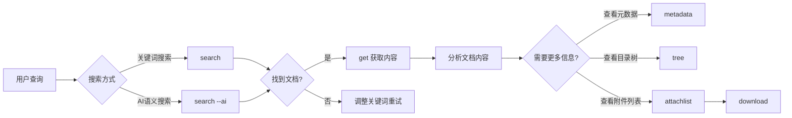

# 场景：搜索、下载、查看和分析文档

**快捷命令：**
```bash
# 搜索文档
iwiki-cli search "关键词"

# AI 搜索
iwiki-cli search "如何部署？" --ai --limit 5

# 获取文档内容
iwiki-cli get 123456

# 获取文档元数据
iwiki-cli metadata 123456

# 查看文档附件列表
iwiki-cli attachlist 123456

# 下载附件
iwiki-cli download <attachmentid> --output ./images/
```

## 工作流程



## 核心工具

### 1. 搜索文档

#### search - 传统关键词搜索（首选）
**何时使用：**
- 需要按空间筛选
- 需要精确的关键词匹配
- 需要分页浏览搜索结果（使用 --offset）
**用法：**
```bash
iwiki-cli search "项目需求文档"
iwiki-cli search "项目需求文档" --limit 10 --offset 0 --spaces "12345"
```
**参数：**
| 参数 | 缩写 | 默认值 | 说明 |
|------|------|--------|------|
| `--limit` | `-l` | 5 | 返回结果数量 |
| `--offset` | `-o` | 0 | 分页偏移量 |
| `--spaces` | `-s` | "" | 空间 ID 列表，逗号分隔 |
| `--topics` | `-t` | "" | 专题 ID 列表，逗号分隔 |
| `--ai` | `-a` | false | 启用 AI 搜索模式 |

#### search --ai - AI 语义搜索
**何时使用：**
- 传统搜索无结果时
- 查询词是完整句子或问题
- 需要理解查询意图
**用法：**
```bash
iwiki-cli search "如何配置持续集成流水线？" --ai --limit 10
```

### 2. 读取文档内容
#### get - 获取完整文档
**用途：** 获取文档的完整 Markdown 内容
**用法：**
```bash
iwiki-cli get 123456
```
#### metadata - 获取文档元数据
**用途：** 了解文档的基本信息
**用法：**
```bash
iwiki-cli metadata 123456
```

**返回信息：**
- 创建时间和作者
- 最后修改时间和修改者
- 文档标题
- 所属空间

### 3. 查看文档结构
#### tree - 获取目录树
**用途：** 查看空间的文档结构
**用法：**
```bash
iwiki-cli tree --parent 12345
```

### 4. 下载福阿进
#### attachlist - 查看文档的附件列表
**用途：** 获取指定文档下的所有附件信息，便于确认附件 ID 后再下载
**用法：**
```bash
iwiki-cli attachlist 123456
iwiki-cli attachlist 123456 -l 20
iwiki-cli attachlist 123456 --start 10
```
**参数：**
| 参数 | 缩写 | 默认值 | 说明 |
|------|------|--------|------|
| `--limit` | `-l` | 10 | 每页返回数量 |
| `--start` | `-s` | 0 | 起始偏移量（分页） |

### 5. 下载附件
#### download - 下载附件文件
**用途：** 根据附件 ID 下载附件到本地
**用法：**
```bash
iwiki-cli download 78910
iwiki-cli download 78910 --output ./images/
```

## 实践示例
### 示例 1：查看文档元数据和搜索相关文档
**用户需求：** "查看文档 123456 的基本信息"
**执行步骤：**
1. **获取文档元数据**
```bash
iwiki-cli metadata 123456
```
2. **获取文档内容**
```bash
iwiki-cli get 123456
```

### 示例 2：搜索结果翻页
**用户需求：** "搜索'API文档'，查看第3页结果"
**执行步骤：**
1. **计算 offset**
```
每页 5 条（默认），第 3 页的 offset = (3-1) * 5 = 10
```
2. **执行搜索**
```bash
iwiki-cli search "API文档" --offset 10
```

### 示例 3：使用 AI 搜索并获取文档
**用户需求：** "搜索如何部署微服务"
**执行步骤：**
1. **AI 搜索**
```bash
iwiki-cli search "如何部署微服务" --ai --limit 5
```
2. **获取文档内容**
```bash
iwiki-cli get 123456
```

### 示例 4：浏览空间目录结构
**用户需求：** "查看空间的文档树"
**执行步骤：**
1. **获取空间信息**
```bash
iwiki-cli space devcloud
```
2. **获取目录树**
```bash
iwiki-cli tree --parent 12345
```
## 错误处理

| 错误 | 原因 | 解决方案 |
|------|------|----------|
| 搜索无结果 | 关键词不准确 | 尝试 AI 语义搜索或调整关键词 |
| 文档不存在 | docid 错误或已删除 | 确认 docid 是否正确 |
| 无权限访问 | 用户无查看权限 | 联系文档所有者申请权限 |
| 附件下载失败 | attachmentid 错误 | 确认附件 ID 是否正确 |

## 注意事项

1. **搜索结果可能很多：** 使用 --offset 分页，避免一次性获取过多结果
2. **AI 搜索有限额：** 优先使用传统搜索，AI 搜索作为补充
3. **附件链接有时效：** 下载链接是临时的，需要及时使用
